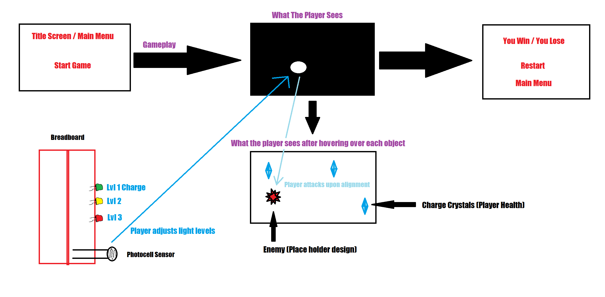
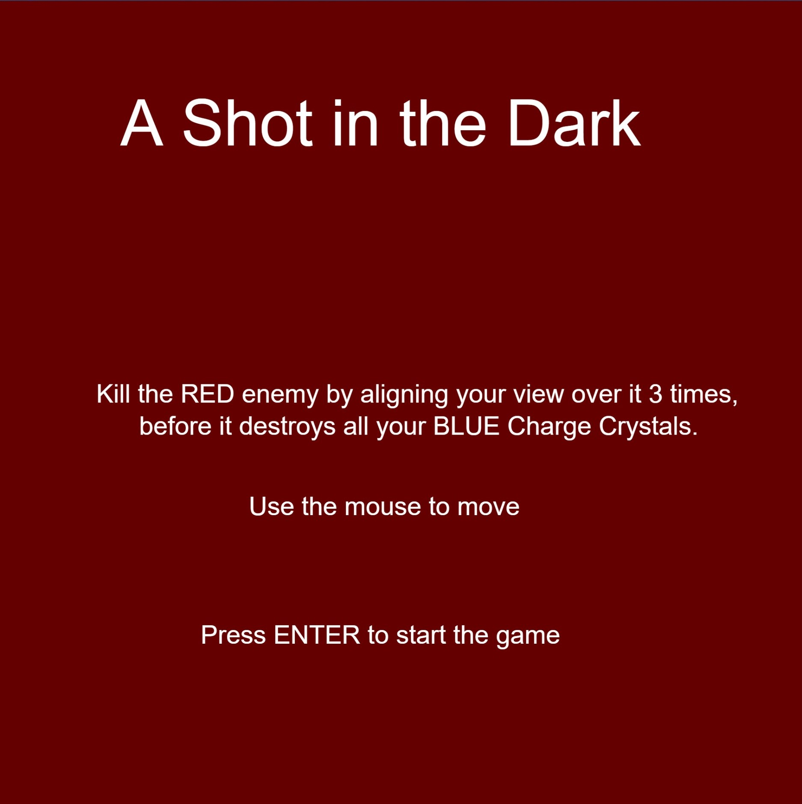
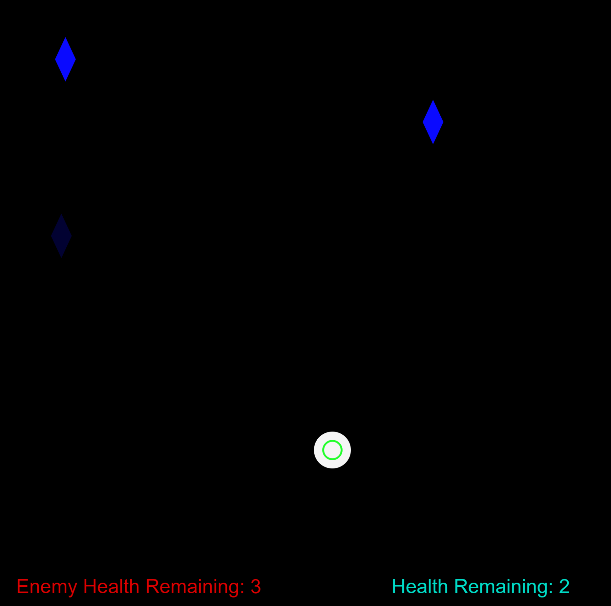
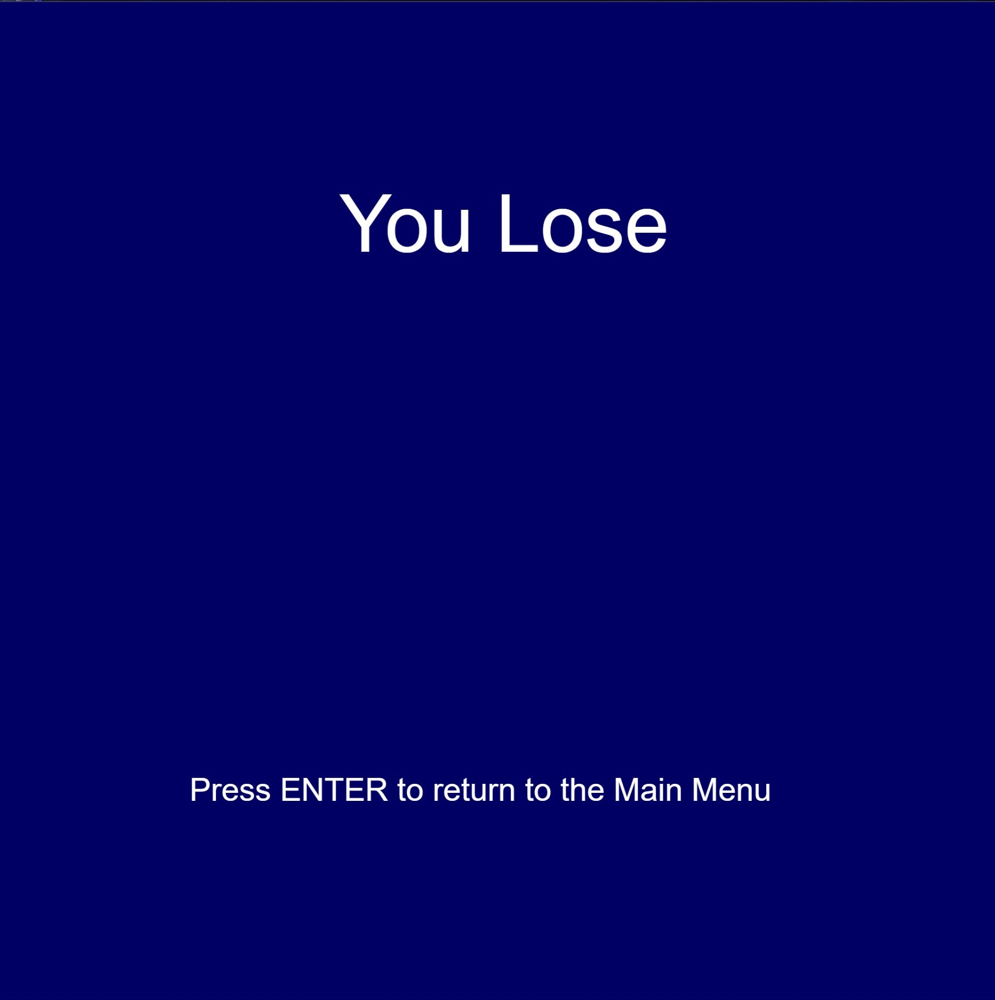
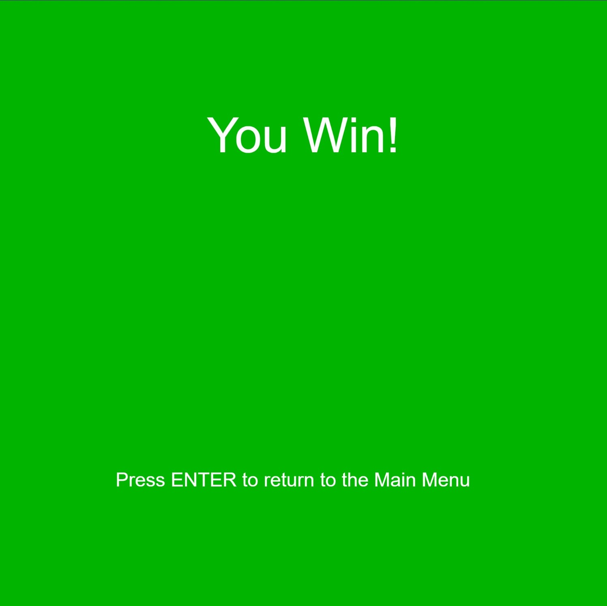
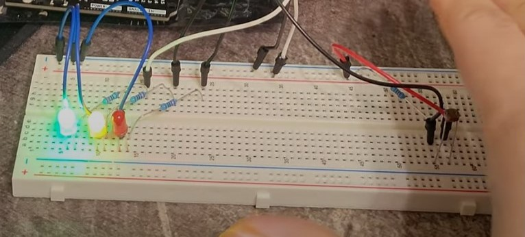

# kpate41_FinalProject Documentation

Single Player Game 
Video Demo: https://www.youtube.com/watch?v=-kCHVVqf0A0&ab_channel=KP

Game Name: A Shot in the Dark

Physical Board used: Elagoo Uno R3 (Starter Kit)

There is only 1 player & 1 enemy.

Player Objective:	The player is a “Ray Gun” (a circle of light), that needs to search for the enemy in the darkness and kill it.

Enemy Objective:	There are 3 moving “Charge Crystals” hidden in the darkness that the enemy will attempt to destroy. (The player must kill it before all 3 are destroyed.)

Ray Gun concept:	It is controlled by the mouse and has 4 charge levels, Zero, Low, Medium, and High.
	The Charge level will be controlled by the player, by manipulating the light level on a Photocell sensor.
	Each level allows the player to expand the area they can see, in the circle they control.
	
There are 3 LEDs to show what the current charge level is, no lights is Zero, 1 is Low, 2 is Medium, and 3 is High.

Project Drawing

--------------------------------------

Graphical Component: 3 Scenes

	Scene 1: Main Menu
		Game Title
		Start Button

--------------------------------------
Scene 2: Game Play

	Player is the circle of dynamic light (ray gun), moving to reveal & attack the enemy.
	Enemy is hidden in the space of the canvas. (Has 3 lives & gains an extra life for each Charge Crystal destroyed.)
	3 Charge Crystals (Player Health) that move around the map, and the player must protect them from the enemy before they get destroyed. 

--------------------------------------
Scene 3: Game Over

	“You Lose” or ”You Win” title
	Main Menu Button

  
--------------------------------------

Physical Component: 1 Analog Input & 3 Digital Outputs + Mouse & Keyboard
	Mouse Input
	Controls the player. (The Ray Gun’s circle)
	Keyboard: Enter Button
	To change scenes when prompted.
	Analog Input: Photocell Sensor
	The light level of the real world will dictate the charge level of the Ray Gun.
	(If it’s too bright for 2 seconds, the gun will overheat & become unusable for 5 seconds.)
	3 Digital Outputs: 3 LEDs
	The 3 LEDs will display the 3 distinct charge levels of the player’s Ray Gun.

--------------------------------------

Future Outline

First and foremost, in the future, all the sounds that were originally planned would be implemented and functional. All the important sounds include:
	A background music for the Main Menu
	A sound for the ray gun that increases in pitch & volume as the beam’s charge level increases.
	A sound for when the ray gun overheats & cools down.
	A sound for when the Charge Crystals are attacked & destroyed.
	2 different background music for the Game Over screen, respective to the title being “You Lose” or “You Win”.
A gameplay mechanic, where the ray gun (the player circle) overheats from staying on Max charge and has to cooldown, before being able to see anything & start attacking again.

Some animations of when a crystal breaks or if the enemy is near by a crystal would help give more visual feedback to the player, that the Enemy exists, despite not being able to see it.

A difficulty system would be a good implementation in the future, to have less randomized speeds and spawn positions of every crystal & enemy, to fixed levels of speed & spawn locations.
This would help reduce the chances of the difficulty suddenly increasing, from the moment the game starts, due to the Enemy, often, spawning nearby the crystals.

Tweaking some player parameters, such as size increase per level, hitbox size, and attack cooldown between each attack on the enemy would improve the balance of the game, in order for it to not feel too easy, due to the rapid speed at which the player can move the mouse across the canvas.
